import { H } from '../src/components'

## SVG Animations: From Common UX Implementations to Complex Responsive Animation by Sarah Drasner (2017)

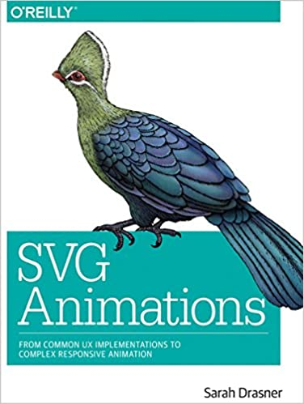

- Learn how to make SVG cross-browser compatible, backwards compatible, optimized, and responsive
- Plan and debug animation
- Make a complex animation responsive, as many sites are responsive
- Profile each animation technique in terms of performance so that you know what you're getting in to with each library or native technology

## Creating Web Animations: Bringing Your UIs to Life by Kirupa Chinnathambi (2017)

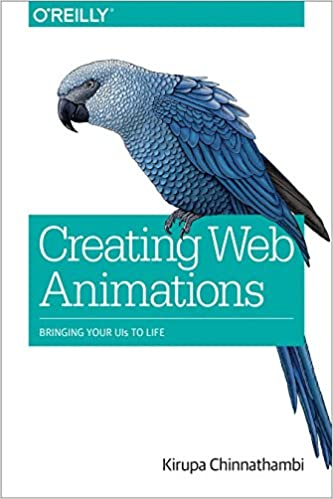

> Thanks to faster browsers, better web standards support, and more powerful devices, the web now defines the next generation of user interfaces that are fun, practical, fluid, and memorable. The key? Animation. But learning how to create animations is hard, and existing learning material doesn't explain the context of the UI problem that animations are trying to solve. That's where this book comes in. You'll gain a solid technical understanding of how to create awesome animations using CSS and learn how to implement common UI patterns, using practical examples that rely on animations to solve a core problem. Frontend web developers and designers only will learn important technical details, but also how to apply them to solve real-world problems.

## Modern CSS by Joe Attardi (2020)

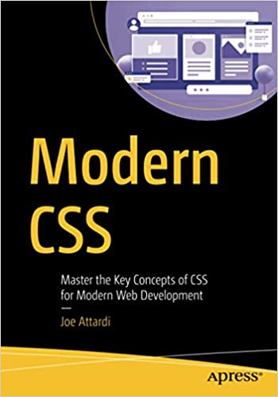

> **Who This book is for** Anyone who has some experience with HTML, and some CSS, but might not be familiar with some of the newer concepts like flexbox or grid. Also, those looking for a refresher in those areas.

## Transitions and Animations in CSS by Estelle Weyl (2016)

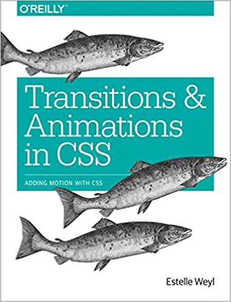

> This practical book shows you how CSS transitions and animations provide a way to control how a property changes from one value to the next over time. You can make the property value change gradually, creating pleasant and hopefully unobtrusive effects. CSS transitions let you decide which properties to animate, how long to wait before the animation starts, how long the transition should take, and how the transition will proceed—all of which are customizable.

## Architecting CSS by Martine Dowden and Michael Dowden (2020)

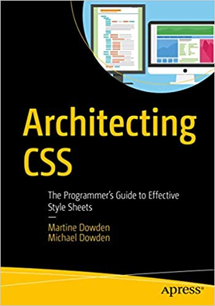

> **Who This Book Is For** Primarily for front-end web developers and UI designers and anyone who works with CSS, particularly if they find it cumbersome and inelegant. It’s also suitable for software architects and tech leads who are responsible for the maintainability of their code base.

## Responsive Web Design with HTML5 and CSS: Develop future-proof responsive websites using the latest HTML5 and CSS techniques, 3rd Edition by Ben Frain (2020)

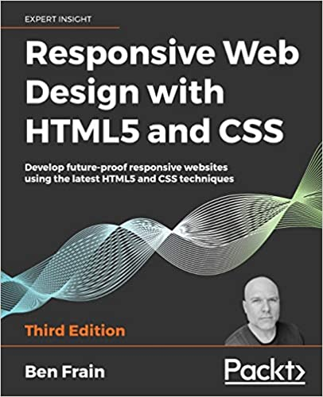

## CSS: The Definitive Guide by Eric Meyer (2017)

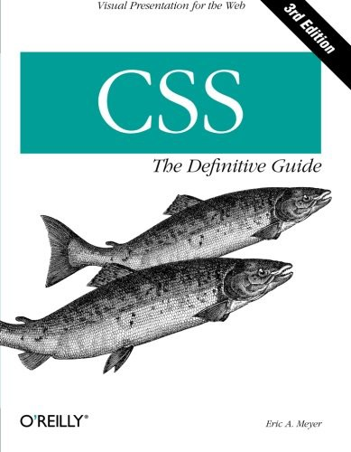

This guide covers:

- Selectors, specificity, and the cascade
- Values, units, fonts, and text properties
- Padding, borders, outlines, and margins
- Colors, backgrounds, and gradients
- Floats and positioning tricks
- Flexible box layout
- The new Grid layout system
- 2D and 3D transforms, transitions, and animation
- Filters, blending, clipping, and masking
- Media and feature queries

## CSS Secrets: Better Solutions to Everyday Web Design Problems by Lea Verou (2015)

> In this practical guide, CSS expert Lea Verou provides <H>47 undocumented techniques and tips</H> to help intermediate-to advanced CSS developers devise elegant solutions to a wide range of everyday web design problems.

## CSS Visual Dictionary by Greg Sidelnikov (2018)

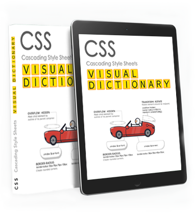

> CSS Visual Dictionary — will get you <H>over 250 visual diagrams</H> explaining all CSS properties and values currently supported by all major browsers in common use. Every single *important CSS property has been documented and visualized with large, clear and easy to understand diagrams. This volume covers CSS box model, working with text, element position modes, <H>3D transforms, CSS grid, flex</H> and many others.

## CSS: The Missing Manual 4t Edition by David Sawyer McFarland (2015)

> CSS lets you create professional-looking websites, but learning its finer points can be tricky — even for seasoned web developers. This fully updated edition provides the most modern and effective tips, tricks, and tutorial-based instruction on CSS available today. Learn how to use new tools such as Flexbox and Sass to build web pages that look great and run fast on any desktop or mobile device. Ideal for casual and experienced designers alike.

## The Book of CSS3: A Developer’s Guide to the Future of Web Design by Peter Gasston (2014)

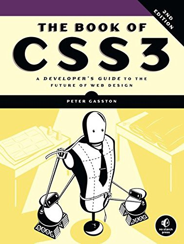

- Style text with custom font choices, drop shadows, and other effects;
- Create, position, and resize background images on the fly;
- Spice up static web pages with event-driven transitions and animations;
- Apply 2D and 3D transformations to text and images;
- Use linear and radial gradients to create smooth color transitions;
- Take control of layout with grids, columns, and flexible alignment;
- Tailor a website’s appearance to every type of web-capable device.

## CSS Pocket Reference by Eric A. Meyer (2018)

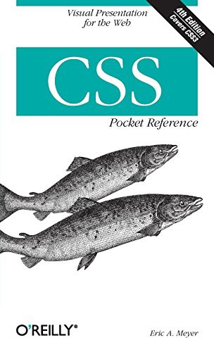

> When you’re working with CSS and need a quick answer, CSS Pocket Reference delivers.

## CSS Mastery by Andy Budd and Emil Björklund (2016)

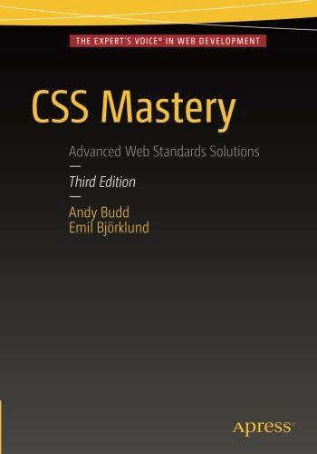

- Discover the best practice concepts in CSS design;
- Master the most important (and tricky) parts of CSS;
- Identify and fix the most common CSS problems;
- Deal with the most common bugs;
- See the latest information on CSS features and support.

## Resources

- [Best CSS Books](https://medium.com/level-up-web/best-css-books-in-2017-3cec8466cc3f)
