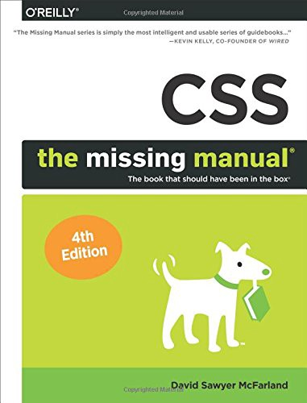

import { H } from '../src/components'

## The List

### CSS: The Definitive Guide by Eric Meyer

> Author Eric Meyer tackles the subject with passion, exploring in detail each individual CSS property and how it interacts with other properties. You’ll not only learn how to avoid common mistakes in interpretation, you also will benefit from the depth and breadth of his experience and his clear and honest style. This is the complete sourcebook on CSS.

### CSS Secrets: Better Solutions to Everyday Web Design Problems by Lea Verou

> In this practical guide, CSS expert Lea Verou provides <H>47 undocumented techniques and tips</H> to help intermediate-to advanced CSS developers devise elegant solutions to a wide range of everyday web design problems.

### CSS Visual Dictionary

> CSS Visual Dictionary — will get you <H>over 250 visual diagrams</H> explaining all CSS properties and values currently supported by all major browsers in common use. Every single *important CSS property has been documented and visualized with large, clear and easy to understand diagrams. This volume covers CSS box model, working with text, element position modes, <H>3D transforms, CSS grid, flex</H> and many others.

### CSS: The Missing Manual by David Sawyer McFarland

> CSS lets you create professional-looking websites, but learning its finer points can be tricky — even for seasoned web developers. This fully updated edition provides the most modern and effective tips, tricks, and tutorial-based instruction on CSS available today. Learn how to use new tools such as Flexbox and Sass to build web pages that look great and run fast on any desktop or mobile device. Ideal for casual and experienced designers alike.

### The Book of CSS3: A Developer’s Guide to the Future of Web Design

- Style text with custom font choices, drop shadows, and other effects;
- Create, position, and resize background images on the fly;
- Spice up static web pages with event-driven transitions and animations;
- Apply 2D and 3D transformations to text and images;
- Use linear and radial gradients to create smooth color transitions;
- Take control of layout with grids, columns, and flexible alignment;
- Tailor a website’s appearance to every type of web-capable device.

### CSS Pocket Reference by Eric A. Meyer

> When you’re working with CSS and need a quick answer, CSS Pocket Reference delivers.

### CSS Mastery

- Discover the best practice concepts in CSS design;
- Master the most important (and tricky) parts of CSS;
- Identify and fix the most common CSS problems;
- Deal with the most common bugs;
- See the latest information on CSS features and support.

## Resources

- [Best CSS Books](https://medium.com/level-up-web/best-css-books-in-2017-3cec8466cc3f)
